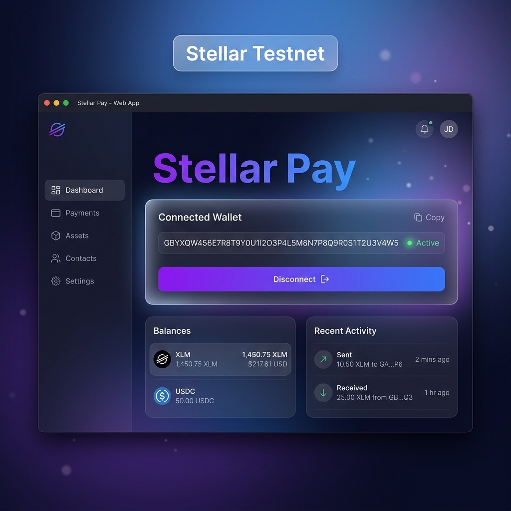
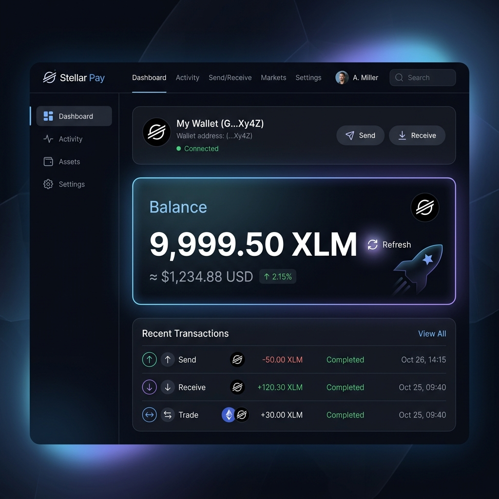
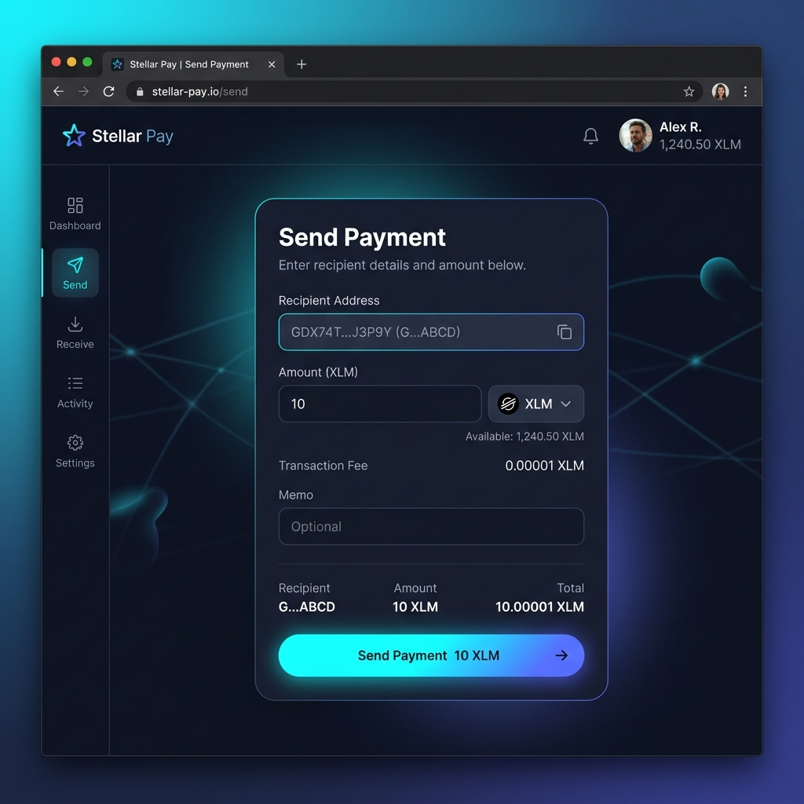
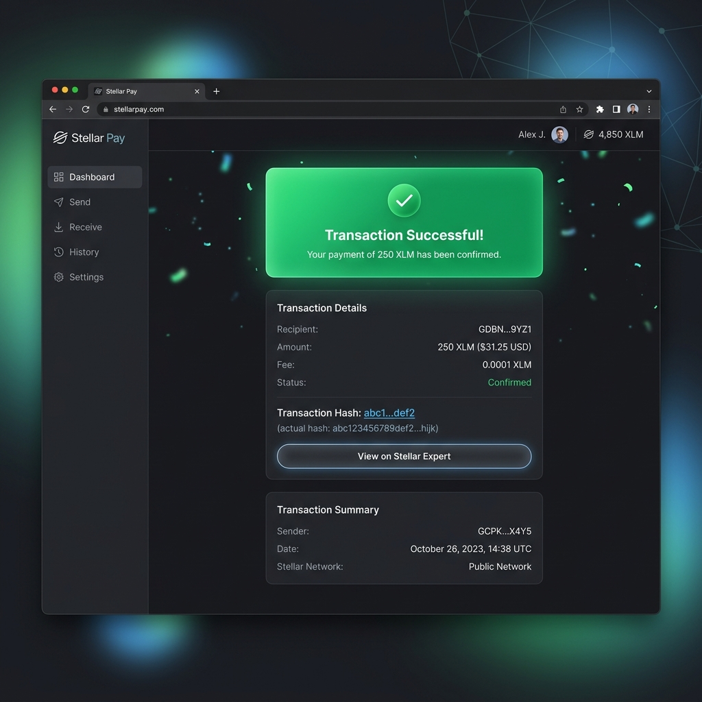

# Stellar Pay Lite

A premium, modern Stellar **testnet** payment dApp built with React, Tailwind CSS, the Stellar SDK, and Freighter wallet integration. This application allows users to connect their wallet, view their XLM balance, and send payments securely on the testnet.

## Features

- **Wallet Integration**: Connect and disconnect with the Freighter browser extension.
- **Balance Tracking**: Real-time XLM balance fetching from the Stellar Horizon (testnet) API.
- **Secure Payments**: Build and sign Stellar payment transactions via Freighter.
- **Transaction History**: Immediate feedback with transaction hashes and links to Stellar Expert.
- **Modern UI**: Sleek, dark-themed interface with responsive design and smooth animations.

## Setup Instructions

To run this project locally on your machine, follow these steps:

### Prerequisites

- **Node.js**: Version 20 or higher.
- **pnpm**: The project uses pnpm workspaces. Install it via `npm install -g pnpm`.
- **Freighter Wallet**: Install the [Freighter browser extension](https://freighter.app/) and set it to **Test Network**.

### Running Locally

1. **Install Dependencies**:
   Open your terminal in the root directory and run:
   ```bash
   pnpm install --ignore-scripts
   ```
   *(Note: `--ignore-scripts` is recommended on Windows to bypass platform-specific pre-install checks).*

2. **Start the Application**:
   Run the following command to start the development server:
   ```powershell
   $env:PORT=3000; $env:BASE_PATH='/'; pnpm --filter @workspace/stellar-pay dev
   ```

3. **Access the App**:
   Open your browser and navigate to [http://localhost:3000](http://localhost:3000).

## Screenshots

### 1. Wallet Connected State
Once you approve the connection in Freighter, your public key is displayed securely.


### 2. Balance Displayed
The app fetches your live XLM balance from the Stellar Testnet.


### 3. Send Payment Form
Enter the recipient's Stellar address and the amount of XLM you wish to send.


### 4. Successful Transaction
After signing the transaction with Freighter, the result is displayed with a link to the explorer.


## Tech Stack

- **Frontend**: React, Vite, TypeScript
- **Styling**: Tailwind CSS, Lucide React (Icons)
- **Blockchain**: @stellar/stellar-sdk, @stellar/freighter-api
- **State/Routing**: Wouter, React Query

## Notes

- This dApp targets the **Stellar Testnet** only.
- Ensure your account is funded via [Friendbot](https://friendbot.stellar.org/) before sending payments.
- Freighter must be configured to use the **Test Network** in its settings.
